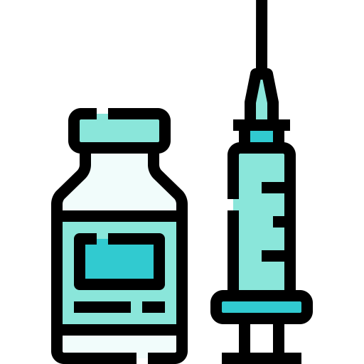

# vacine-ja-grupo-10
vacine-ja-grupo-10 created by GitHub Classroom

     
     

## **`Vacine ja!`**
O "Vacine ja!" é um sistema que tem o objetivo de permitir que funcionários e profissionais de saúde façam o acompanhamento da imunização no país. Além disso, a população vai se beneficiar com este sistema para ser notificada das datas e locais de vacinação.

---

     
     

---
### Grupo:
---
* Artur Brito (https://github.com/arturbs)
* Caetano Albuquerque (https://github.com/caetanobca)
* Caio Davi (https://github.com/caiodavic)
* Fernando Lisboa (https://github.com/fernandollisboa)
* Holliver Costa (https://github.com/HolliverCosta)

---
# [Especificação](https://docs.google.com/document/d/1rzK3t730M2SYpK3b8HmLQiCY7dAGeePDxXKbn6Xqjmk/edit?usp=sharing)

---
# Login do Administrador
- Cpf: 00000000000
- Senha: admin
- Tipo de Login: Administrador
